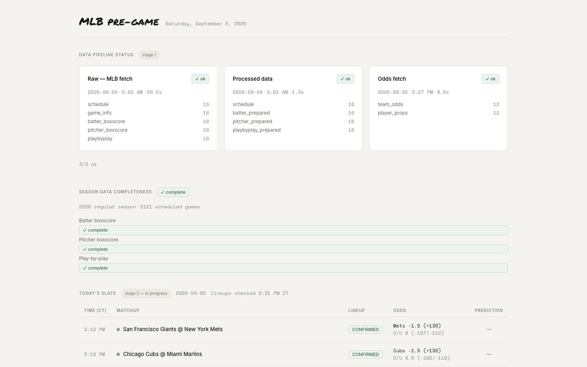

# MLB Prop Research

An ML system for MLB prop research (DraftKings): ingest game/odds data, build point-in-time-safe features, and test whether any prediction target here clears a naive baseline before it's treated as real signal.

---

## Data

S3 bucket `mlbdk` (us-east-2), Parquet, partitioned `{table}/{year}/{YYYY-MM-DD}.parquet` — one file per table per date, past dates never overwritten.

| Source | Coverage | Notes |
|---|---|---|
| Game data (schedule, box scores, play-by-play) — MLB Stats API | 2016–present | 2020/2021 excluded from model training (COVID-shortened season) |
| Odds (team lines + player props) — The Odds API | Live daily since ~2026-05 | A one-off historical pull (10x normal credit cost) added 2025 season-long coverage for backtesting; nothing before 2025 exists |
| DraftKings slate (contest/player pool) | Live daily | Feeds lineup/slate context, not itself a training source |

Pipeline layers, in order:

- Layer 1 — Raw Ingestion (MLB Stats API to S3) — **done**
- Layer 2 — Validation (quality gate before downstream runs) — **done**
- Layer 3 — Feature Engineering (rolling-window features to S3) — **in progress**
- Layer 4 — Feature Store (Feast, offline S3, online DynamoDB) — **in progress**: 2 features (`n_pa_predictor`'s `batting_order`, `avg_n_pa_per_game`) run live, event-triggered off real lineup confirmations, proven end-to-end into DynamoDB
- Layer 5 — Model Training (XGBoost baseline to attention model) — **in progress**
- Layer 6 — Prediction Pipeline (daily batch inference, lineup-aware) — **in progress**: `daily_predict` is deployed and proven live for `n_pa_predictor`'s `low_pa` model — `daily_feature_materialize` invokes it directly, confirmed via real CloudWatch logs and a real prediction written to S3
- Layer 7 — MLOps (MLflow, Evidently AI, CloudWatch) — **not started**

Layer 3's feature functions are tested and reusable, but every model still re-pulls and rebuilds full-season data in a one-off script rather than a scheduled incremental job — see `CLAUDE.md` for the full layer breakdown.

A FastAPI + React dashboard (`dashboard/`, `make dashboard-dev`) surfaces this day-to-day: Lambda run status and staleness, today's slate, season data-completeness, and a starting-pitcher predictions table (sample data, real games — no inference path yet). See `dashboard/README.md` for what's built.

**Model split, consistent across all six models below:** train on seasons `[2017, 2018, 2019, 2022, 2023, 2024, 2025]` minus val/test, val = 2024 (iterated against during development), test = 2025 (locked, never touched until a model is final). `k_predictor` additionally has a live 2026 real-market backtest (66 dates, 1,160 starts matched against real DraftKings lines) — the only check in this repo against real prices rather than a naive floor.

---

## The prop matrix

Every prop here is a per-PA classifier (hit, walk, strikeout — home run not yet built) rolled up two ways: by batter, via `n_pa_predictor`'s PA-count estimate, or by pitcher, via `batters_faced_predictor`'s — the "allowed" version of the same prop. Outs recorded is arithmetic (batters faced minus hits and walks allowed), not its own model. Pitcher props are ahead in the table below mostly because that count is bigger — ~22 batters faced vs. ~4 plate appearances — a working reason, not a settled one; see `DECISIONS.md`'s 2026-09-05 entry for the fuller case.

Two PA/batters-faced "engine" models feed the per-prop classifiers below, both `real_improvement`:

- `n_pa_predictor` (batter's PA count tonight) feeds the batter props:
  - Batter Hits — `hit_predictor` — flat vs. naive
  - Batter Walks — `bb_predictor` — overconfidence_risk
  - Batter Home Runs — not started
- `batters_faced_predictor` (pitcher's batters faced tonight) feeds the pitcher-allowed props:
  - Pitcher Hits Allowed — untried, no new model needed
  - Pitcher Walks Allowed — untried, no new model needed
  - Pitcher Strikeouts — `k_predictor` — real_improvement, no edge vs. market

Two things worth noticing: **Pitcher Hits Allowed and Pitcher Walks Allowed need zero new modeling** — both classifiers and `batters_faced_predictor` already exist, nobody's combined them — and **only `k_predictor` is actually production-real**. `hit_predictor` and `bb_predictor`'s game-level checks use the *realized* PA count from the box score, not a prediction, so neither could run before a game starts yet.

## Models ranked by performance vs. naive

Ranked by verdict tier first (`real_improvement` beats `overconfidence_risk` beats "hasn't cleared naive"), then by relative lift within a tier. Metrics differ by model (PR-AUC, precision, MAE, resolution) — treat this as directional, not a literal cross-model comparison. Full experiment history: `DECISIONS.md`.

| Rank | Model | Bin | Performance vs. naive |
|---|---|---|---|
| 1 | `n_pa_predictor` (`low_pa`) | Batter | 19.8% base rate → 64.7% precision @ 0.85 confidence (+45pp, ~3.3x) — `real_improvement`, threshold already locked |
| 2 | `k_predictor` (K-prop) | Pitcher | PR-AUC 0.226 → 0.284 (+26%) — `real_improvement`, but confirmed no edge against real 2026 market odds |
| 3 | `batters_faced_predictor`* | Pitcher (infra) | MAE 2.861 → 2.647 (-7.5%) — `real_improvement`, but vs. the cascade formula, not naive |
| 4 | `short_outing_predictor` | Pitcher | PR-AUC 0.309 → 0.440 (+42%) — the largest raw lift of any model here, but `overconfidence_risk` |
| 5 | `bb_predictor` (BB-prop) | Pitcher | PR-AUC 0.076 → 0.096 (+26%) — `overconfidence_risk` |
| 6 | `hit_predictor` | Batter | Resolution 0.0182 → 0.0162 (-11%, worse) — still hasn't beaten naive |

\* Not a standalone DK prop — supporting infra for `k_predictor`'s total-strikeout rollup.

Weaker candidates considered and set aside: player rest-day/will-not-start (useful as a feature, not a standalone target), stolen-base attempts (narrow population, smaller market).

---

**Read next**, depending on what you're after:
- `ROADMAP.md` — the living plan: current priorities and backlog
- `DECISIONS.md` — dated history of every session's findings and corrections
- `dashboard/README.md` — the pre-game dashboard: pipeline health, slate, data-completeness checks
- `src/models/hit_predictor/BENCHMARKS.md` — full experiment results table, what "beating baseline" means here
- `src/models/hit_predictor/FEATURE_GLOSSARY.md` — every feature, implemented or not
- `CLAUDE.md` — repo conventions, infra reference (ingestion → processing → feature store, S3 layout), commands, test layout

**Non-goal right now:** proving this beats the market. The bar is "real, defensible signal" — the economic/CLV layer (comparing model output against DraftKings' actual de-vigged prices) is deliberately deferred until there's a model worth staking behind.
